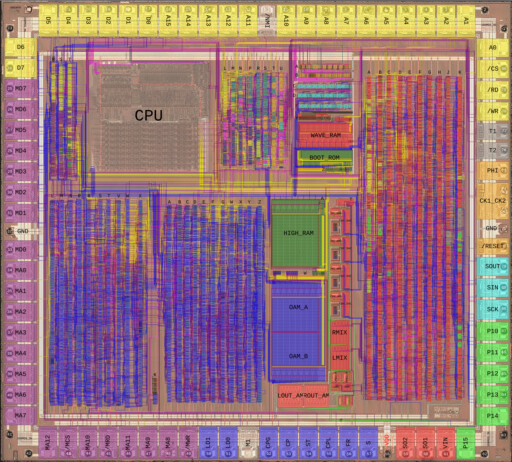

Game Boy DMG CPU B Leaflet Map
==============================

Web-based map of the Game Boy DMG-CPU B chip with overlays.

Made with [Leaflet](https://leafletjs.com/), [Leaflet-Minimap](https://github.com/Norkart/Leaflet-MiniMap/),
[Leaflet-Nanoscale](https://github.com/whitequark/Leaflet.Nanoscale/) and
[Leaflet-PolylineMeasure](https://github.com/ppete2/Leaflet.PolylineMeasure).


Live version of the map
-----------------------

You can use the latest version of the map [here](http://iceboy.a-singer.de/dmg_cpu_b_map/).




Getting the images and generating the tiles
-------------------------------------------

The source images that are needed to create the tile layers for the map are not part of this repository. The die shots
have to be downloaded and the transparent overlays can either be generated from netslists or downloaded from github as
explained below.

First, create a folder named `img_src` in this repositories top level directory, so we can put the source images
in there. The scripts in the `script` folder take the source images from there.

Download the two die shots (`nintendo_dmg-cpu-b_mcmaster_mz_mit20x.jpg` and
`nintendo_dmg-cpu-b_mcmaster_s1-1_mit20x.jpg`) from [here](https://siliconpr0n.org/map/nintendo/dmg-cpu-b/single/)
and put them into the `img_src` folder (or symlink them from there).

You can download the latest overlay images from [here](https://iceboy.a-singer.de/dmg_cpu_b_map/img_src/)
or you can generate them by yourself. Either way, place the images into the `img_src` folder as well. To generate them
yourself, you need the netlists from the [dmg-schematics](https://github.com/msinger/dmg-schematics) repository and
the conversion tool from [here](https://github.com/msinger/nlconv). Build the conversion tool (nlconv.exe) like described
[here](https://github.com/msinger/nlconv/blob/master/INSTALL). You need to have `mono` installed. Then change into the
`netlist` directory of the dmg-schematics repository and run `make cells floorplan labels wires`. This generates four PNG
files: `cells.png`, `floorplan.png`, `labels.png` and `wires.png`. Copy them into your `img_src` directory.

You should now have the following source image files:
```
img_src/cells.png
img_src/floorplan.png
img_src/labels.png
img_src/nintendo_dmg-cpu-b_mcmaster_mz_mit20x.jpg
img_src/nintendo_dmg-cpu-b_mcmaster_s1-1_mit20x.jpg
img_src/wires.png
```

Now change into the `scripts` directory and run the script that applies some transformations to the die shots:
```
cd scripts
./transform_die_shots.sh
```

The scripts require ImageMagick! to be installed. After running the transformation, your `img_src` directory
should look like this:
```
img_src/cells.png
img_src/die_mz_20x.png
img_src/die_s1_1_20x.png
img_src/floorplan.png
img_src/labels.png
img_src/nintendo_dmg-cpu-b_mcmaster_mz_mit20x.jpg
img_src/nintendo_dmg-cpu-b_mcmaster_s1-1_mit20x.jpg
img_src/wires.png
```

The original two die shots are no longer required now. The newly generated die shots (`die_mz_20x.png` and
`die_s1_1_20x.png`) have the same size as the PNG overlays and are aligned with them.

While your working directory is still the `scripts` directory, run the last script that converts all images to tiles:
```
./gen_all.sh
```

The tiles will be output into the `map` directory. Now you should be able to open the `index.html` file
in a browser to use the map. You can delete the `img_src` directory now to save space.
