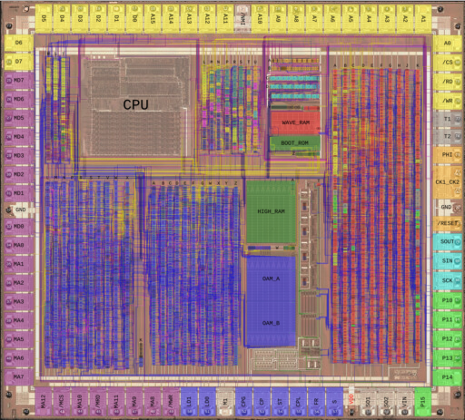

Game Boy DMG CPU B Leaflet Map
==============================

Web-based map of the Gameboy DMG-CPU B with overlays.

Made with [Leaflet](https://leafletjs.com/), [Leaflet-Minimap](https://github.com/Norkart/Leaflet-MiniMap/),
[Leaflet-Nanoscale](https://github.com/whitequark/Leaflet.Nanoscale/) and
[Leaflet-PolylineMeasure](https://github.com/ppete2/Leaflet.PolylineMeasure).


Live version of the map
-----------------------

You can use the latest version of the map [here](http://iceboy.a-singer.de/dmg_cpu_b_map/).




Getting the images and generating the tiles
-------------------------------------------

The actual images are not included in this repository. They have to be manually exported from Inkscape
and then processed by `scripts/gen_tiles.sh`.

You can get the SVG file which contains the cells, wires and labels overlays
[here](https://github.com/msinger/dmg-schematics/tree/master/dmg_cpu_b/overlay).

Short instructions and download links for the die shots can be found
[here](https://github.com/msinger/dmg-schematics#overlay).

Once you've opened the SVG in Inkscape, you have to export each layer, one by one, using these export settings:

<br>

Export the transparent layers as PNGs and the die shots as JPEG.

Create a folder called `img_src` in this repo and put the files in there with the following names:
```
img_src/cells.png
img_src/die_mz_20x.jpg
img_src/die_s1_1_20x.jpg
img_src/labels.png
img_src/wires.png
```

Then change into the `scripts` directory and run the script that converts all images to tiles:
```
cd scripts
./gen_all.sh
```
`gen_all.sh` runs `gen_tiles.sh` for each of the images, which uses ImageMagick's `convert` command for cropping and
scaling the images. So you need to have ImageMagick installed for this to work.

The tiles will be output into the `map` directory. Now you should be able to open the `index.html` file
in a browser to use the map.
